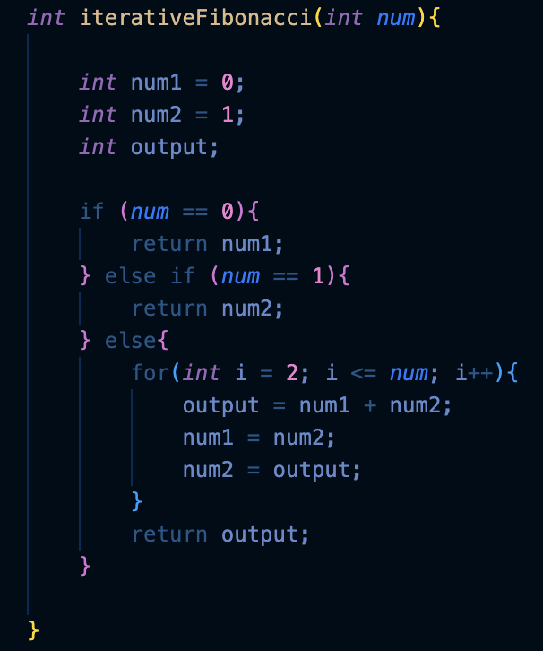

## Fibonacci
#
The Fibonacci sequence is a set of integers that starts with a zero, a one, and another one. Then the numbers steadily increases. The sequence follows the rule that each number is equal to the sum of the last two numbers.

To calculate a Fibonacci number, we can use 2 methods: Iterative and Recursive.

### Iterative Method


### Recursive Method


### Command used to run:
```c
make test
./main_test.out
```

### Output:
```
The fibonacci number for 10 is 55
The fibonacci number for 10 is 55
The fibonacci number F0 = 0 = 0
The fibonacci number F1 = 1 = 1
The fibonacci number F2 = 1 = 1
The fibonacci number F3 = 2 = 2
The fibonacci number F4 = 3 = 3
The fibonacci number F5 = 5 = 5
The fibonacci number F6 = 8 = 8
The fibonacci number F7 = 13 = 13
The fibonacci number F8 = 21 = 21
The fibonacci number F9 = 34 = 34
The fibonacci number F10 = 55 = 55
```

#

## Benchmark (Time Complexity)
### Recursive
Command for running:
```
make time-recursive
./main_b_time_recursive.out
```
Output:
```
Time elapsed: 0.113225 s
```

### Iterative
Command for running:
```
make time-iterative
./main_b_time_iterative.out
```

Output:
```
Time elapsed: 0.000008 s
```
#
## Benchmark (Space Complexity)
### Recursive
Command for running:
```
make space-recursive
./main_b_space_recursive.out

make space-iterative
./main_b_space_recursive.out
```

### Results:

#
## Conclusion
As a result, between the two methods, the iterative method is the quickest and most effective. It has less time and space complexity overall. 

